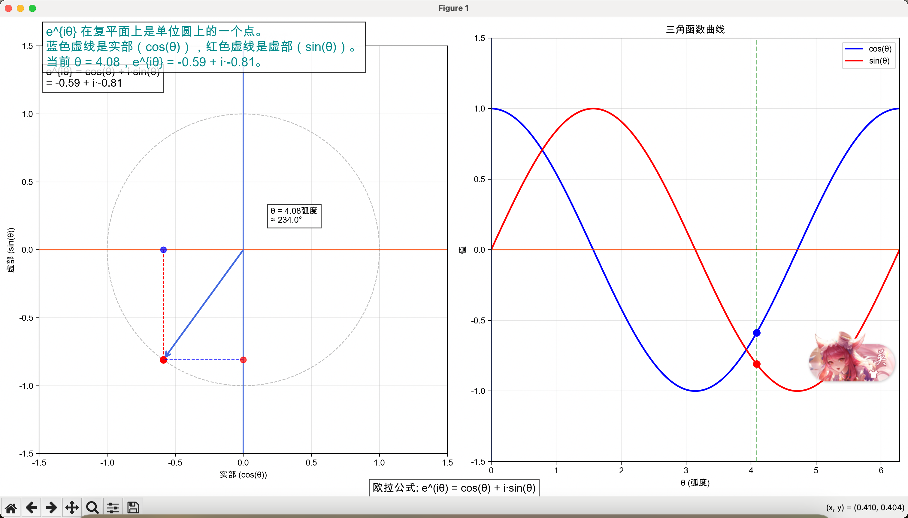

# Tools 工具集

这是一个包含多个实用工具的集合，用于处理图片、PDF、数学公式等任务。

## 图片处理 (image)

- 图片压缩工具
  - 支持 PNG 格式图片压缩
  - 可自定义压缩质量
  - 使用方法：`python png_compressor.py <input_file> <output_file>`

## PDF 处理 (pdf)

- PPT 原位翻译工具
  - 支持 PPT 文件中的文本翻译
  - 保持原有格式和布局
  - 支持中英文互译
  - 使用方法：`python ppt_translator.py <input_file> <output_file>`

## 水印处理 (rm_watermark)

- 图片水印去除工具
  - 支持常见水印的智能去除
  - 保持图片质量
  - 使用方法：`python remove_watermark.py <input_file> <output_file>`

## 数学工具 (math)

- 数学公式可视化工具
  - 泰勒级数可视化
  - 欧拉公式可视化
  - 辅助数学学习
  - 使用方法：
    - 泰勒级数：`python taylor_visualization.py`
    - 欧拉公式：`python euler_formula_visualization.py`

## Transformer 实现 (simple_transformers)

- 简单 Transformer 模型实现
  - 包含完整的 Transformer 架构实现
  - 支持数字识别任务
  - 包含详细的模型解释文档
  - 主要功能：
    - 模型训练：`python train_digit_transformer.py`
    - 预测：`python predict.py`
    - 生成测试图像：`python generate_test_image.py`
  - 相关文档：
    - Transformer 原理说明：`transformer_explanation.md`
    - 前馈网络说明：`feed_forward_explanation.md`

## 环境要求

每个工具目录下都有独立的 `requirements.txt` 文件，请根据具体需求安装相应的依赖：

```bash
pip install -r <tool_directory>/requirements.txt
```

## 示例



## 注意事项

1. 使用前请确保已安装所需的 Python 依赖
2. 部分工具可能需要额外的系统依赖，请参考各工具目录下的 README 文件
3. 建议在使用前备份原始文件
4. 对于 Transformer 模型，需要确保有足够的计算资源进行训练
