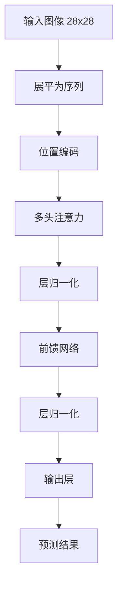

# 简单 Transformer 模型实现

这个项目实现了一个简单的 Transformer 模型，用于识别 MNIST 数据集中的数字 1 和 2。该项目主要用于学习 Transformer 的基本概念和实现。

## 项目结构

```
.
├── simple_transformer.py    # Transformer模型的核心实现
├── train_digit_transformer.py  # 训练脚本
├── predict.py              # 预测脚本
├── requirements.txt        # 项目依赖
└── README.md              # 项目文档
```

## 核心组件说明

### 1. 位置编码 (PositionalEncoding)

位置编码是 Transformer 的重要组成部分，用于为序列中的每个位置添加位置信息。

```python
class PositionalEncoding(nn.Module):
    def __init__(self, d_model, max_len=5000):
        # d_model: 模型的维度
        # max_len: 序列的最大长度
```

主要功能：

- 使用正弦和余弦函数生成位置编码
- 为每个位置生成唯一的编码向量
- 帮助模型理解序列中元素的位置关系

### 2. 多头注意力机制 (MultiHeadAttention)

多头注意力机制允许模型同时关注输入序列的不同部分。

```python
class MultiHeadAttention(nn.Module):
    def __init__(self, d_model, num_heads):
        # d_model: 模型的维度
        # num_heads: 注意力头的数量
```

主要功能：

- 将输入分成多个头，每个头独立计算注意力
- 实现缩放点积注意力机制
- 合并多个头的结果得到最终输出

### 3. 数字识别 Transformer (DigitTransformer)

整合上述组件，构建完整的模型用于数字识别。

```python
class DigitTransformer(nn.Module):
    def __init__(self, d_model=64, num_heads=4):
        # d_model: 模型的维度
        # num_heads: 注意力头的数量
```

主要功能：

- 输入处理：将 28x28 的图像转换为序列
- 位置编码：添加位置信息
- 注意力计算：使用多头注意力机制
- 输出层：进行二分类（1 和 2）

## 使用指南

### 1. 环境配置

安装所需依赖：

```bash
pip install -r requirements.txt
```

### 2. 模型训练

运行训练脚本：

```bash
python train_digit_transformer.py
```

训练过程将：

- 自动下载 MNIST 数据集
- 只使用数字 1 和 2 的样本
- 训练 10 个 epoch
- 保存训练好的模型
- 生成训练过程可视化图表

### 3. 模型预测

1. 准备测试图像：

   - 图像应该是手写数字 1 或 2
   - 支持常见图像格式（PNG、JPG 等）
   - 图像会被自动转换为 28x28 的灰度图

2. 运行预测：

```bash
python predict.py
```

预测脚本将：

- 加载训练好的模型
- 预处理输入图像
- 输出预测结果和置信度

示例输出：

```
使用设备: cpu
预测结果: 数字 1
置信度: 95.23%
```

## 模型架构



## 主要参数说明

- `d_model`：模型的维度，默认 64
- `num_heads`：注意力头的数量，默认 4
- `batch_size`：批次大小，默认 64
- `learning_rate`：学习率，默认 0.001
- `num_epochs`：训练轮数，默认 10

## 输出文件

- `digit_transformer.pth`：训练好的模型
- `training_history.png`：训练过程的可视化结果

## 注意事项

1. 数据预处理：

   - 图像被标准化到[0,1]范围
   - 标签从[1,2]转换为[0,1]

2. 模型特点：

   - 使用残差连接
   - 包含层归一化
   - 使用 ReLU 激活函数

3. 训练过程：

   - 使用 Adam 优化器
   - 使用交叉熵损失函数
   - 支持 GPU 训练（如果可用）

4. 预测要求：
   - 输入图像必须是手写数字 1 或 2
   - 图像会被自动调整为 28x28 大小
   - 支持 CPU 和 GPU 预测
